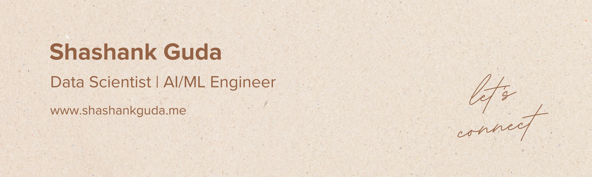

 

  <h1>Hello 👋, I'm Shashank Guda</h1>
  

    Accomplished Data Science professional with a strong background in Machine Learning, Data Analytics, and Business Intelligence. Adept at leveraging cutting-edge technologies, including LLMs, LangChain, and Cloud platforms, to drive data-driven solutions. Proven ability to translate complex data into actionable insights, streamline processes, and optimize operations. Skilled in project management, stakeholder collaboration, and delivering high-quality results within tight deadlines. Committed to continuous learning and professional growth in the rapidly evolving field of Data Science.
  

  

---

### 🙋‍♂️ About Me:
- 🎓 Currently a Graduate Student at [Syracuse University](https://www.syracuse.edu/) 🍊
- 🌱 I’m currently learning LangChain, LLMs
- 💻 Interned at [Inferenz](https://inferenz.ai/) as a Jr. AI/ML Engineer
- 💼 Previously worked as an Analytics Consultant at [Tredence](https://www.tredence.com/)
- 📫 Connect with me on [LinkedIn](https://www.linkedin.com/in/shashankguda/)
- ✍️ My Blogs [Medium](https://medium.com/@shashankguda)

---

### 🚀 Skills and Technologies:

  
  
  
  
  
  
  
  
  
  
  
  
  
  
  
  
  
  
  
  
  
  
  
  
  
  
  
  
  
  
  

---

### 🌟 Featured Projects:
- [Project 1](https://github.com/gudashashank/EqualEyes): EqualEyes aims to advance image captioning technology by combining recent advances in image recognition and language modeling to generate rich and detailed descriptions beyond simple object identification.
- [Project 2](https://github.com/gudashashank/compass-assistant): COMPASS is an AI-powered university guidance system that helps international students find and track university programs, living expenses, and career opportunities in the United States. The system provides personalized recommendations based on user preferences and maintains an interactive chat interface for queries about universities, costs, weather, and job prospects.
- [Project 3](https://github.com/gudashashank/tokyo-olympics-analysis): This project aims to build a cloud-based data pipeline using Azure services to analyze and visualize the 2021 Tokyo Olympics dataset. The pipeline integrates data ingestion, transformation, and visualization to unlock insights into athlete demographics, country performance, and event participation.
- [Project 4](https://github.com/gudashashank/apu-sensor-failure-prediction): This project focuses on detecting anomalies in the Auxiliary Power Unit (APU) of metro trains using sensor data. The goal is to enable predictive maintenance, enhance system reliability, and minimize downtime by identifying potential failures early.
- [Project 5](https://github.com/gudashashank/Austin_Animal_Data_Analysis): This project involves a comprehensive analysis of data from the Austin Animal Center to understand trends in animal intakes, outcomes, and stray locations. By merging and analyzing multiple structured datasets, project aims to identify factors contributing to stray animal cases and develop strategies to address the issue. The analysis includes exploratory data analysis, preprocessing, and actionable insights to improve adoption rates and animal welfare.

---

## ☕ Show your support

  

<!-- This is a comment in Markdown -->
